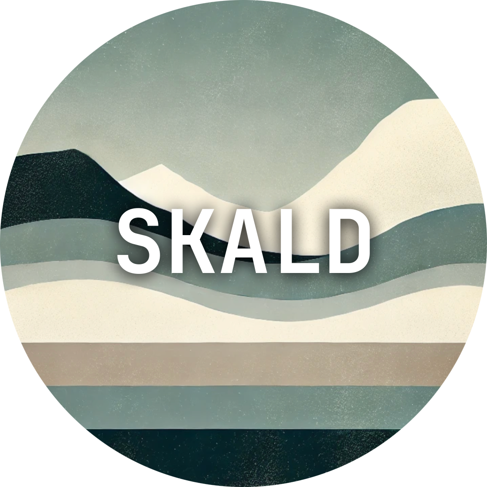

<div align="center">
  
  <p align="center">
    <br>
    Encrypted Local Journal in Rust
    <br/>
  </p>
</div>

**Skald** (will be) a file-based, encrypted digital journal written in Rust. Each entry will be timestamped, encrypted, and immutable after it is saved.

## Project Overview

Skald is a learning project where the primary focus is to build a secure, file-based journal application using Rust. Initially, it will be a command-line interface (CLI) application, but it will eventually evolve into a desktop app with a graphical user interface (GUI) using Tauri.

## Goals

1. **Learn Rust**: The primary goal of this project is to deepen understanding of Rust, particularly with regard to file handling, error management, and secure systems programming.
2. **Security**: Each entry should be encrypted before it's saved.
3. **Integrity**: Implement some mechanism to prevent tampering.
4. **Cross-Platform GUI**: Build a GUI using Tauri (and some UI framework) for desktop.
5. **Learn Systems Programming**: I might over-engineer some areas to make this project a gateway into low-level programming.

## Tech Stack (Prel.)

- **Rust**: For building the backend (CLI, encryption, file handling).
- **Tauri**: For the GUI desktop app (future goal).
- **sha2**: Cryptographic hashing, immutability.

## Installation

_Installation instructions will be added._

For now, one can clone the repository and build the project with Cargo:

```bash
git clone https://github.com/bjornthiberg/skald.git

cd skald

cargo build
```
